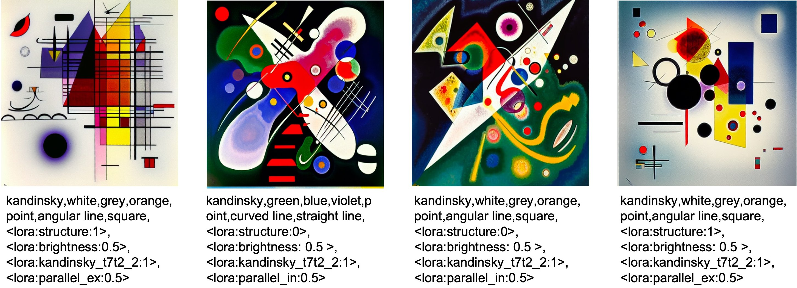
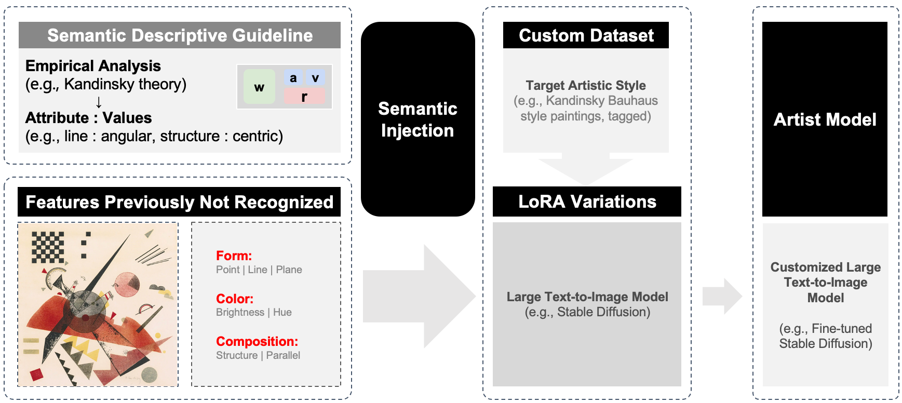
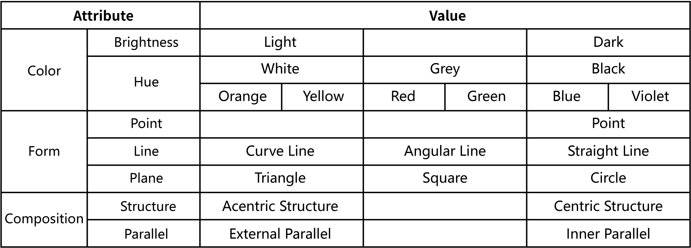
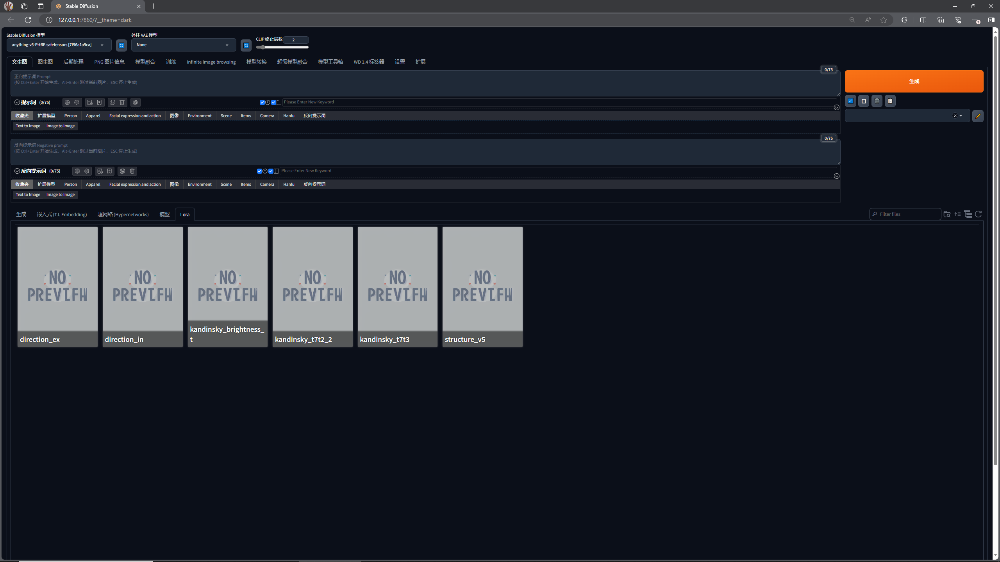
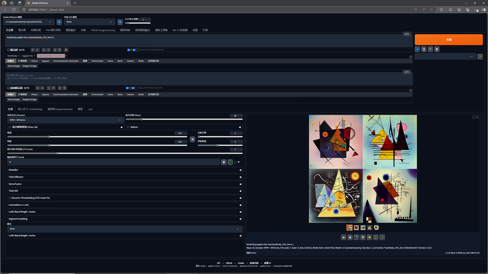
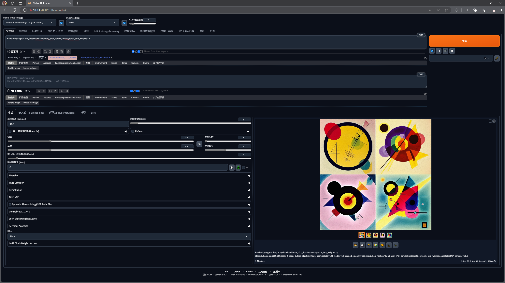

## Kandinsky as Preferred

Prompting with our Artist Model in deterministically controllable manner.

 “Kandinsky As You Preferred” introduces a generative approach that empowers users to easily work with a large text-to-image (TTI) model to create their preferred painterly content. We propose a large model personalization method, namely Semantic Injection, to personalize a large TTI model in a given specific artistic style, i.e., Kandinsky’s paintings in Bauhaus era, as the Artist Model. Through working with a Kandinsky expert, the authors first establish a se- mantic descriptive guideline and a TTI dataset of Kandinsky style and then apply the Semantic Injection method to obtain an Artist Model of Kandinsky, empowering users to create preferred Kandin- sky content in a deterministically controllable manner. Details can be found in our poster publication [Kandinsky as Your Preferred](https://doi.org/10.1145/3641234.3671061) accepted to SIGGRAPH Posters '24.

### How It Works

How Semantic Injection personalizes large TTI model.

Semantic descriptive guideline: Kandinsky style

### Inference Artist Model

In ./lora_models are our fine-tuned models (we termed it as "artist model" through our "semantic injection" process) with the Kandinsky dataset (in ./dataset). We applied two methods for the "semantic injection," including fastLora for attributes with discrete values such as shapes and diffLora for attributes with continuous values (such as color brightness and composition-relevant attributes). 

We use [Stable Diffusion v1-5](https://huggingface.co/runwayml/stable-diffusion-v1-5) as the base model and our fine-tuned LORA models together in webui. To inference our Artist Model, move all the LORA models (without their parent folders) to the root folder of stable diffusion webui such as SD-root/models/LORA, then it's ready to go! If the Lora model is successfully loaded, it should look like this.

<!-- https://github.com/0xbitches/sd-webui-lcm -->

<!-- https://comfyanonymous.github.io/ComfyUI_examples/inpaint/ -->

Prompting with the Kandinsky keywords:

It also works with [LCM sampler](https://huggingface.co/latent-consistency/lcm-lora-sdv1-5/blob/main/pytorch_lora_weights.safetensors). When generating in 8 steps, the inference is significantly faster.  

