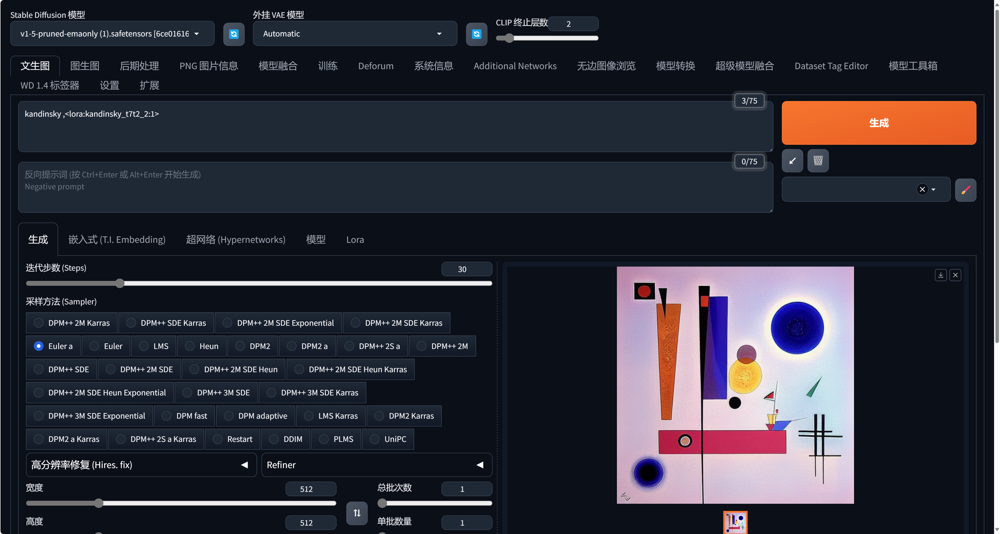

## Kandinsky as Preferred

“Kandinsky As You Preferred” introduces a generative approach that empowers users with a prompting-free experience to create their preferred painterly content with a large text-to-image model based solely on their aesthetic preferences. This repo hosts the code of our genetic algorithm and the dataset when working LoRA as well as our fine-tuned lora models. Details can be found in our poster publication [Kandinsky as Your Preferred](https://arix.org) accepted to SIGGRAPH Posters '24 (DOI: 10.1145/3641234.3671061).

### Inference the Artist Model

In ./lora_models are our fine-tuned models (we termed it as "artist model" through our "semantic injection" process) with the Kandinsky dataset (in ./dataset). We applied two methods for the "semantic injection," including fastLora for attributes with discrete values such as shapes and diffLora for attributes with continuous values (such as color brightness and composition-relevant attributes). To inference the Artist Model, place the lora models in the root folder of stable diffusion webui such as /models/lora, then it's ready to go!

### Prompting-free Experience with Genetic Optimization

<embed src="./imgs/flowchart.pdf" type="application/pdf" >
GeneticKandinsky_2024.ipynb implements a genetic algorithm automatically assembles keywords and descriptions (attribute value sets in our research) of Kandinsky's art as prompts based on Kandinsky's art theory. The user votes for preferred generative results till satisfied, the prompting model will be optimized based on the preference input.  

We use sd-webui as the text2image function and api, the user votes to update and optimize the genetic prompting function in real-time and eventually obtain the prompting-free yet satisfying experience of using large text-to-image to generate visual art.