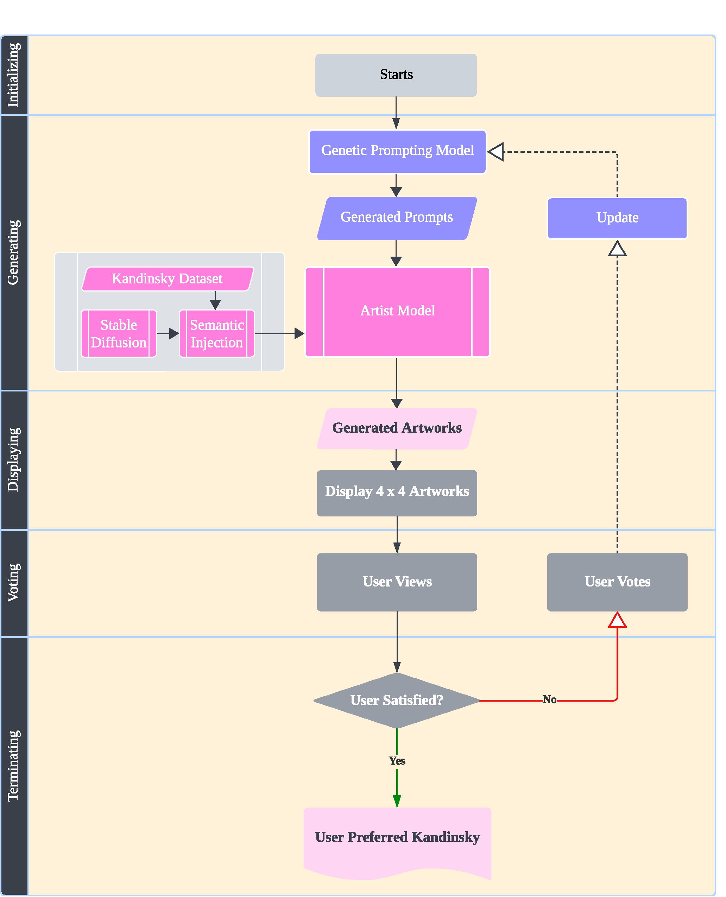

### Prompting-free Experience with Genetic Optimization

GeneticKandinsky_2024.ipynb implements a genetic algorithm that automatically assembles keywords and descriptions (attribute value sets in our research) of Kandinsky's art as prompts based on Kandinsky's art theory. The user votes for preferred generative results till satisfied, the prompting model will be optimized based on the preference input.  

We use sd-webui as the text2image function and api, the user votes to update and optimize the genetic prompting function in real-time and eventually obtain the prompting-free yet satisfying experience of using large text-to-image to generate visual art.